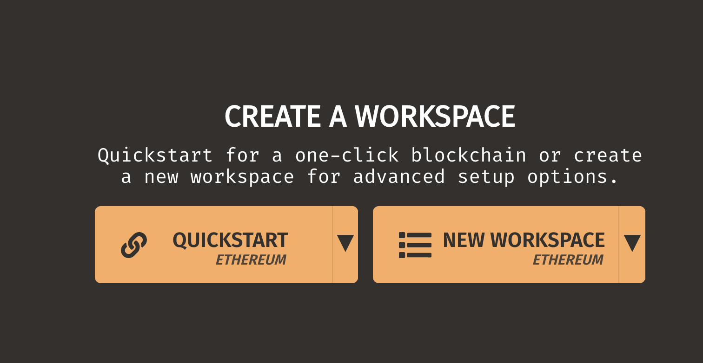
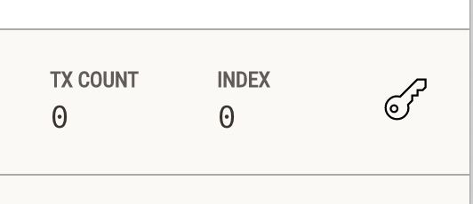

# cashless

## Installation 

1. Install ganache here: https://www.trufflesuite.com/ganache
(You can also run ganache-cli in a terminal but it can be nice to have the GUI)

2. Clone this repo 
(First you must install git globally and be granted access to this repo)

```
git clone https://github.com/superarius/cashless.git
cd cashless
```

3. Start Ganache

If you installed it above just double click the application to open it. 

Choose 'quickstart'



4. Copy private keys from ganache into line

Click on the 'key' for three addresses and get the private key, copy it into the obvious place in `testKeys.js`




6. Run tests (this will execute against local server)

```
node cashless.js
```

